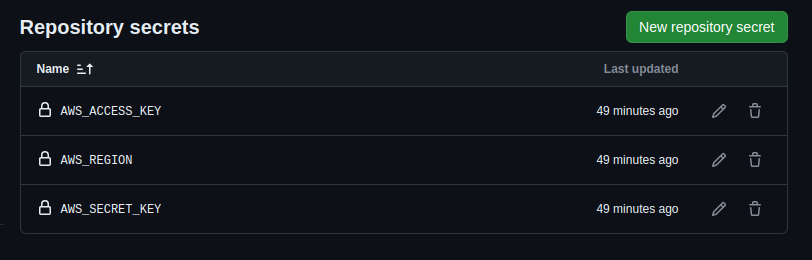
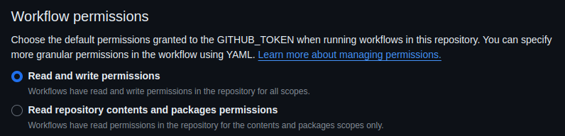

# Kafkamoon API

Welcome to Kafkamoon, a Kafka management application. This This project demonstrates integration
with [Kafka APIs](https://docs.confluent.io/kafka/kafka-apis.html) as part of a hiring test.

## Table of Contents

1. [Getting Started](#getting-started)
    - [Prerequisites](#prerequisites)
    - [Running the Project Locally](#running-the-project-locally)
    - [Running Only the Documentation](#running-only-the-documentation)
2. [How-to Guides](#how-to-guides)
3. [References](#references)
4. [Explanation](#explanation)
5. [Continuous Integration](#continuous-integration)
6. [Terraform GitOps](#terraform-gitops)
7. [Accessing the Kubernetes Cluster](#accessing-eks)
## Getting Started

### Prerequisites

Before you begin, make sure you have the following tools installed:

- **Java:** Version 17
- **Maven:** Version 3.9.6
- **Docker**
- **Docker Compose**

### Running the project locally

To run the project locally, follow these steps:

1. Clone the repository:

```shell
git clone git@github.com:mcruzdev/kafkamoon.git
```

2. Navigate to the project directory:

```shell
cd kafkamoon-api
```

3. Build the application:

```shell
make buildAll
```

4. Start the application using Docker Compose:

```shell
docker-compose --profile local up -d
```

After the application is running, you can interact with the following resources:

* [OpenAPI specification](http://localhost:8080/swagger-ui.html) for exploring and interacting with the API.
* [Kafkamoon Documentation](http://localhost:3000) for additional information and guidance.


### Running the project locally on Kubernetes

To run the project locally on Kubernetes, follow these steps:

1. Create the Kubernetes cluster:

```shell
kind create cluster --name local --config=k8s/kind-cluster.yaml
```

2. Configure the context:

```shell
kubectl cluster-info --context kind-local
```

3. Apply kubernetes manifests:

```shell
kubectl apply -f k8s/manifests
```

### Running Only the Documentation

To build and run only the documentation, do the following:

1. Build the documentation container:

```shell
make buildDocs
```

2. Run the container:

```shell
docker run --rm -it -p 3000:3000 kafkamoon-docs:latest
```

This starts the documentation server on port 3000.

## How-to guides

For additional guidance on using Kafkamoon, check out our [how-to guides](how-to/).

## Reference

For more detailed information on the Kafkamoon API, refer to our [API references](reference/api.md)
and [configuration references](reference/configurations.md).

## Explanation

If you're interested in learning about the design decisions and other details of the project, visit the [explanation section](explanation/?id=explanation).

## Continuous Integration

The Continuous Integration (CI) pipeline contains all necessary configuration to maintain the standardization on the project through spotless maven plugin.

## Terraform GitOps

This repository contains a GitOps for Terraform through Github Actions.

### How it works?

All pull request branches with `terraform/*` prefix will trigger the [workflow](.github/workflows/terraform-plan.yaml).

The `Terraform GitOps Plan` workflow sends a comment describing the output generated by `terraform plan`.

### When is `terraform apply` happens?

The `terraform apply` happens when is made a push on `main` branch.

> [!IMPORTANT]
> Is very important to configure a branch protection rule to evict mistakes.

### How it was configured?

Was necessary do some steps:

1. Create a IAM user on AWS with access key and secret key;
2. Configure access key, secret key and region on Github for this repository;

3. Allow permissions for workflows to create comments on pull requests;


## Configuring Kubernetes Cluster

1. Update the local kubeconfig

```shell
aws eks update-kubeconfig --name platformoon-kafkamoon ${CLUSTER_NAME} --region ${AWS_REGION}
```

2. Add ArgoCD

```shell
kubectl create namespace argocd
kubectl apply -n argocd -f https://raw.githubusercontent.com/argoproj/argo-cd/stable/manifests/install.yaml
```

