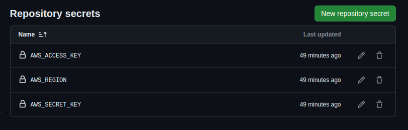

# Kafkamoon API

Welcome to Kafkamoon, a Kafka management application. This This project demonstrates integration
with [Kafka APIs](https://docs.confluent.io/kafka/kafka-apis.html) as part of a hiring test.

## Table of Contents

- [Kafkamoon API](#kafkamoon-api)
  - [Table of Contents](#table-of-contents)
  - [Getting Started](#getting-started)
    - [Prerequisites](#prerequisites)
    - [Running the project locally with Docker Compose](#running-the-project-locally-with-docker-compose)
    - [Running the project locally on Kubernetes](#running-the-project-locally-on-kubernetes)
    - [Running Only the Documentation](#running-only-the-documentation)
  - [How-to guides](#how-to-guides)
  - [Reference](#reference)
  - [Explanation](#explanation)
  - [Continuous Integration](#continuous-integration)
  - [Terraform GitOps](#terraform-gitops)
    - [How it works?](#how-it-works)
    - [When does `terraform apply` happen?](#when-does-terraform-apply-happen)
    - [How it was configured?](#how-it-was-configured)
  - [Configuring Kubernetes Cluster](#configuring-kubernetes-cluster)
  - [Observabilty](#observabilty)
  - [Final Remarks](#final-remarks)
    - [What I Would Have Done If I Had More Time](#what-i-would-have-done-if-i-had-more-time)
## Getting Started

### Prerequisites

Before you begin, make sure you have the following tools installed:

- **Java:** Version 17
- **Maven:** Version 3.9.6
- **Docker**
- **Docker Compose**

### Running the project locally with Docker Compose

To run the project locally, follow these steps:

1. Clone the repository:

```shell
git clone git@github.com:mcruzdev/kafkamoon.git
```

2. Navigate to the project directory:

```shell
cd kafkamoon-api
```

3. Build the application:

```shell
make buildAll
```

4. Start the application using Docker Compose:

```shell
docker-compose --profile local up -d
```

After the application is running, you can interact with the following resources:

* [OpenAPI specification](http://localhost:8080/swagger-ui.html) for exploring and interacting with the API.
* [Kafkamoon Documentation](http://localhost:3000) for additional information and guidance.


### Running the project locally on Kubernetes

To run the project locally on Kubernetes, follow these steps:

1. Create the Kubernetes cluster:

```shell
kind create cluster --name local --config=kind/kind-cluster.yaml
```

2. Configure the context:

```shell
kubectl cluster-info --context kind-local
```

3. Update Helm dependencies

```shell
make helmUpdate
```

4. Package Helm

```shell
make helmPkg
```

5. Install Nginx Ingress Controller

```shell
kubectl apply -f https://raw.githubusercontent.com/kubernetes/ingress-nginx/release-1.8/deploy/static/provider/kind/deploy.yaml
```

5. Install **Kafkamoon** application with Helm:

```shell
make helmInstall
```

6. Get Grafana admin to access Grafana Dashboards

```shell
kubectl get secret kafkamoon-grafana-operator-grafana-admin-credentials -o json | jq '.data.GF_SECURITY_ADMIN_PASSWORD'
```

### Running Only the Documentation

To build and run only the documentation, do the following:

1. Build the documentation container:

```shell
make buildDocs
```

2. Run the container:

```shell
docker run --rm -it -p 3000:3000 kafkamoon-docs:latest
```

This starts the documentation server on port 3000.

## How-to guides

For additional guidance on using Kafkamoon, check out our [how-to guides](how-to/).

## Reference

For more detailed information on the Kafkamoon API, refer to our [API references](reference/api.md)
and [configuration references](reference/configurations.md).

## Explanation

If you're interested in learning about the design decisions and other details of the project, visit the [explanation section](explanation/?id=explanation).

## Continuous Integration

The Continuous Integration (CI) pipeline contains all necessary configuration to maintain the standardization on the project through spotless maven plugin.

## Terraform GitOps

This repository contains a GitOps for Terraform through Github Actions.

### How it works?

All pull request branches with changes on `terraform/*` directory will trigger the [Terraform Plan Workflow](.github/workflows/terraform-plan.yaml).

The `Terraform GitOps Plan` workflow sends a comment describing the output generated by `terraform plan` command.

### When does `terraform apply` happen?

The `terraform apply` happens when is made a push on `main` branch.

> [!IMPORTANT]
> Is very important to configure a branch protection rule to evict mistakes.

### How it was configured?

Was necessary do some steps:

1. Create a IAM user on AWS with access key and secret key;
2. Configure access key, secret key and region on Github for this repository;

3. Allow permissions for workflows to create comments on pull requests;


## Configuring Kubernetes Cluster

1. Update the local kubeconfig

```shell
aws eks update-kubeconfig --name ${CLUSTER_NAME} --region ${AWS_REGION}
```

3. Create a namespace for kafkamoon
Create a secret for pull private repositories

```shell
kubectl create secret docker-registry regcred \
  --docker-server=${AWS_ACCOUNT}.dkr.ecr.${AWS_REGION}.amazonaws.com \
  --docker-username=AWS \
  --docker-password=$(aws ecr get-login-password) \
  --namespace=kafkamoon
```

## Observabilty

Grafana Dashboards:

[SpringBoot Observability](https://grafana.com/grafana/dashboards/11378-justai-system-monitor/)

## Final Remarks

First of all, I would like to thank you for the challenge. It was very interesting and definitely challenging. I developed this solution with an approach as close as possible to a real-world scenario, incorporating documentation for the API user, observability, and a user-friendly interface for API consumers.

### What I Would Have Done If I Had More Time

I would like to point out a few things I would have implemented if I had more time:

- Add security to the API through OAuth2 using Keycloak;
- Include auditing to track:
  - Who created a topic;
  - Who deleted a topic;
- Add endpoints for listing consumer groups;
- Reset consumer offsets to a specific point in time or offset;
- Add a dashboard to monitor Kafka;
- Include alerts for both Kafka and the application;
- Enable viewing of tracing and logs;
- Implement validation for the topic naming convention;
- Add support for `criticality` set to `PRODUCTION`;
- Add rate limiting to protect the application and also safeguard the Kafka cluster.


