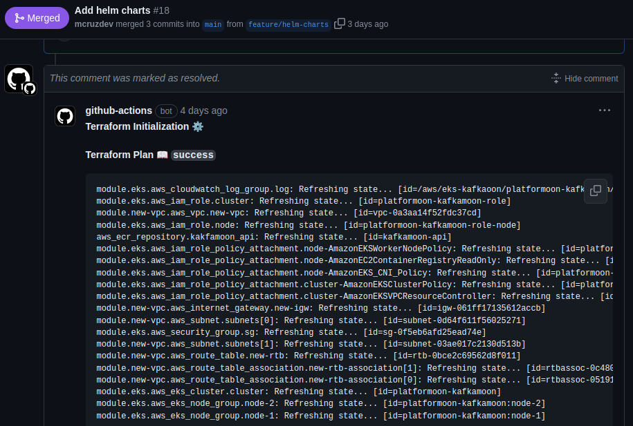

# Explanation

Nessa parte da documentação, preferi escrever em português para facilitar a leitura e avaliação das tomadas de decisão.

!>  Antes de tudo, quero dizer que pensei nessa API como um MVP, então existem muitas coisas a serem melhoradas e listei elas na seção [**O que eu teria feito se tivesse mais tempo**](#o-que-eu-teria-feito-se-tivesse-mais-tempo).

## Sumário

- [Explanation](#explanation)
  - [Sumário](#sumário)
  - [Por que dividir o tópico em três partes?](#por-que-dividir-o-tópico-em-três-partes)
    - [Convenção para nomes de tópicos](#convenção-para-nomes-de-tópicos)
  - [Por que criticality na criação do tópico?](#por-que-criticality-na-criação-do-tópico)
  - [Por que utilizar Terraform com Github Actions?](#por-que-utilizar-terraform-com-github-actions)
    - [Como está configurado o Github Actions?](#como-está-configurado-o-github-actions)
    - [Quando é realizado o terraform apply?](#quando-é-realizado-o-terraform-apply)
  - [Por que utilizar o Helm?](#por-que-utilizar-o-helm)
    - [Configurações do Kafka](#configurações-do-kafka)
  - [O que eu teria feito se tivesse mais tempo?](#o-que-eu-teria-feito-se-tivesse-mais-tempo)

## Por que dividir o tópico em três partes?

Para melhorar a comunicação e padronizar a criação de tópicos, decidi definir uma convenção para nomes de tópicos, com base
neste [blog post](https://cnr.sh/essays/how-paint-bike-shed-kafka-topic-naming-conventions).

### Convenção para nomes de tópicos

O nome do tópico é dividido em três partes: **tipo de mensagem**, **nome do conjunto de dados** e **nome do dado**.

* **Tipo de mensagem** - Indica o tipo da mensagem, que pode ter os seguintes valores:
  * `logging`
  * `queuing`
  * `tracking`
  * `etl/db`
  * `streaming`
  * `push`
  * `user`
* **Nome do conjunto de dados** - É análogo a um nome de banco de dados em sistemas RDBMS tradicionais. É usado como uma categoria para agrupar tópicos.
* **Nome do dado** - É análogo a um nome de tabela em sistemas RDBMS tradicionais, embora seja aceitável incluir uma notação pontilhada adicional se os desenvolvedores desejarem impor sua própria hierarquia dentro do namespace do conjunto de dados.

Um exemplo de nome de tópico onde podemos registrar um evento que ocorreu na **loja** onde o **pacote** foi **recebido**:

> tipo de mensagem: `queuing`
>
> nome do conjunto de dados: `store`
>
> nome do dado: `package-received`

Por padrão, a API concatena esses campos para criar o nome final do tópico, resultando em `queuing.store.package-received`.

!> **IMPORTANTE**: O comprimento máximo permitido para o nome do tópico é de 255 caracteres. Isso significa que o comprimento combinado do tipo de mensagem, nome do conjunto de dados e nome do dado não deve exceder 252 caracteres, deixando espaço para separadores adicionais (`.`).

!> **IMPORTANTE**: A API não valida o `tipo de mensagem` (esta é apenas uma ideia proposta).


## Por que criticality na criação do tópico?

Se você criou um tópico usando a API (`POST /api/v1/topics`), pode ter notado um campo chamado **criticality**. Atualmente, esse campo só suporta os valores **TEST** ou **test**. 

O conceito por trás dessa restrição é ter mais controle e padronização na hora de criarmos os tópicos, trazendo uma ideia de **preset**.  

Gostaria, se tivese mais tempo, permitir ao usuário escolher o `replicationFactor` e `partitions` e validar esses valores com base na **criticality** do tópico. Exemplo, se a aplicação é crítica nível **HIGH** não faria sentido ter apenas uma partition.

## Por que utilizar Terraform com Github Actions?

Sei que existem diversas formas de fazer GitOps para prover infraestrutura através do Terraform (FluxCD, ArgoCD, etc.), mas preferi utilizar o GithubActions pela facilidade de configuração e por se tratar de um MVP.

### Como está configurado o Github Actions?

Basicamente, se você criar um pull request que tenha alterações na pasta `terraform-gitops` a pipeline vai executar um `terraform plan` e vai jogar a saída do comando como um comentário no pull request.



*Exemplo de um comentário realizado pela pipeline que execute o `terraform plan`*.

Penso que isso é útil para saber o que vai ser refletido na infraestrutura atual, isso ajuda e muito na revisão do pull request e evita diversos problemas.

### Quando é realizado o terraform apply?

O **apply** dos recursos de infraestrutura é feito quando há um merge para a branch principal **main** através da pipeline **[Terraform GitOps Apply](https://github.com/mcruzdev/kafkamoon-api/blob/main/.github/workflows/terraform-apply.yaml)**. 

## Por que utilizar o Helm?

Na minha cabeça, eu queria prover toda a aplicação de forma que fosse fácil configurar e que não fosse necessário diversos passos para ter a aplicação executando em um cluster Kubernetes. Isso inclui Grafana configurado com dashboards prontos para uso, kafka, Prometheus e etc. 

Com apenas um Helm package, quem quiser utilizar a aplicação, vai ter ela executando com toda a sua infraestrutura com apenas um comando (`helm install kafkamoon kafkamoon-0.1.0.tgz`).

O Helm chart da aplicação contém os seguintes subcharts:

```yaml
dependencies:
  - alias: kafka
    name: kafka
    repository:  https://charts.bitnami.com/bitnami
    version: 28.0.4
    condition: kafka.enabled
  - alias: prometheus
    name: prometheus
    repository: https://charts.bitnami.com/bitnami
    version: 1.0.6
    condition: prometheus.enabled
  - alias: grafana-operator
    name: grafana-operator
    repository: https://charts.bitnami.com/bitnami
    version: 4.1.0
    condition: grafana-operator.enabled
  - alias: keycloak
    name: keycloak
    repository: https://charts.bitnami.com/bitnami
    version: 21.0.3
    condition: keycloak.enabled
```

No diretório **template** temos a [documentação](https://docs.platformoon.com), a [API](https://kafkamoon.platformoon.com) e alguns recursos necessários para ter o Grafana configurado com prometheus e com os dashboard pré-definidos.

### Configurações do Kafka

Foi necessário duas configurações principais para que a aplicação tivesse os seguintes comportamentos:

- Deletar um tópico
- Somente criar tópicos através da API

Penso que para o primeiro item é importante tê-lo para preencher os requisitos funcionais, mas o segundo é mais importante para garantir que a criação de tópicos seja feita apenas pela API de gerenciamento do Kakfa.


## O que eu teria feito se tivesse mais tempo?

Gostaria de apontar algumas coisas que eu teria implementado se tivesse mais tempo:

- Incluir auditoria para rastrear:
  - Quem criou um tópico;
  - Quem deletou um tópico;
- Adicionar endpoints para listar grupos de consumidores;
- Resetar offsets de consumidores para um ponto específico no tempo ou offset;
- Adicionar um dashboard no Grafana para monitorar o Kafka;
- Incluir alertas para o Kafka e para a aplicação;
- Permitir a visualização de **Tracing** e **Logs**;
- Implementar validação para a convenção de nome de tópicos;
- Adicionar suporte para mais tipos de `criticality`;
- Adicionar **rate limit** para proteger a aplicação e também resguardar o cluster Kafka.
- Adicionar testes para o Helm.
- Permitir a comunicação segura e restrita do Kafka e a API.
