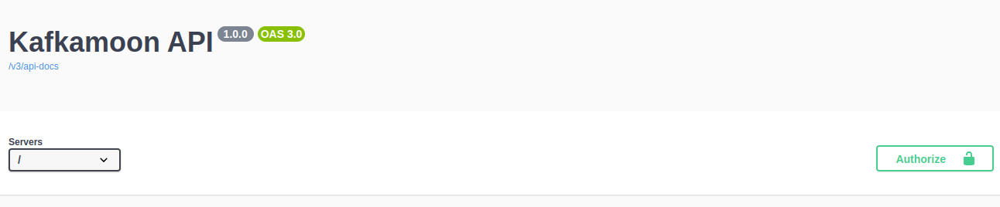

# Keycloak Integration Guide

This project uses Keycloak to manage security. Below, you'll find instructions on how to obtain an access token to interact with the Kafkamoon resources.

## User Roles

In the Keycloak Realm, there are two distinct roles:

- **WRITER**
- **READER**

A `READER` can access endpoints that use the `GET` method.

A `WRITER` can access endpoints that use the `POST` and `DELETE` methods.

## How to Get an Access Token

To obtain an access token, you can use cURL or a similar HTTP client. Follow these steps to get the token:

```shell
curl --request POST \
  --url https://keycloak.platformoon.com/realms/kafkamoon/protocol/openid-connect/token \
  --header 'Content-Type: application/x-www-form-urlencoded' \
  --data grant_type=password \
  --data client_id=<client_id> \
  --data username=<your_username> \
  --data password=<your_password>
```

The response should resemble this:

```shell
{
  "access_token": "",
  "expires_in": 300,
  "refresh_expires_in": 1800,
  "refresh_token": "",
  "token_type": "Bearer",
  "not-before-policy": 0,
  "session_state": "",
  "scope": "profile email"
}
```

Now, you have an `access_token`, which you can use with the "Authorize" button. See below:


